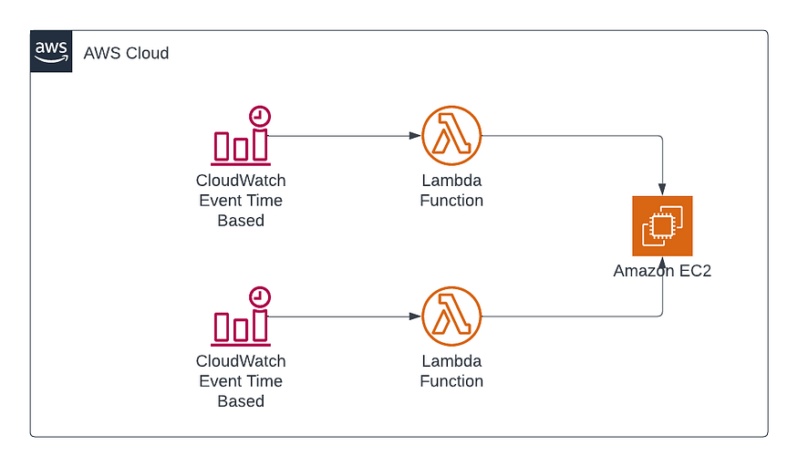

# Serverless EC2 Instance Scheduler for Company Working Hours 
## Scenario :
In some companies there is no need to run EC2 instances 24/7; You need instances for a specific time, such as company working hours, from 8:00 AM in the morning to 5:00 PM in the evening. To handle this scenario, I use two Lambda functions that are responsible for starting and stopping instances. This Lambda function will be triggered by CloudWatch Events both in the morning and in the evening. This solution is completely serverless.

## Setup Guide  :

### Step 1 :
### Creating the Instance :
1. Go to the EC2 Console.
2. Follow the steps below.

### Step 2 :
### Creating the Policy :

1. Navigate to the IAM Console.
2. Click on "Policies" and then Click on "Create policy"

3. Select services as EC2.
4. And Actions are DescribeInstances , StartInstances.

5. Now we have created a policy for starting instances. We also need to create a policy for stopping the instances. This is because we are going to create two Lambda functions: one for starting and one for stopping the instances. Each function will have its own role, and we will attach these two policies to their respective roles. 
6. Now  we are going to repeat the same steps for Creating Stopping Policy also. 
7. Everything is same , Except Actions because we are going to stop the instance. 
8. The Actions are DescribeInstances , StopInstances . 
9. Keep your Plolicy name as "stop-ec2-instance".

## Step 3 :
## Creating the Lambda functions :

1. Navigate to the lambda Console.
2. Follow the Outlined steps below.
.
