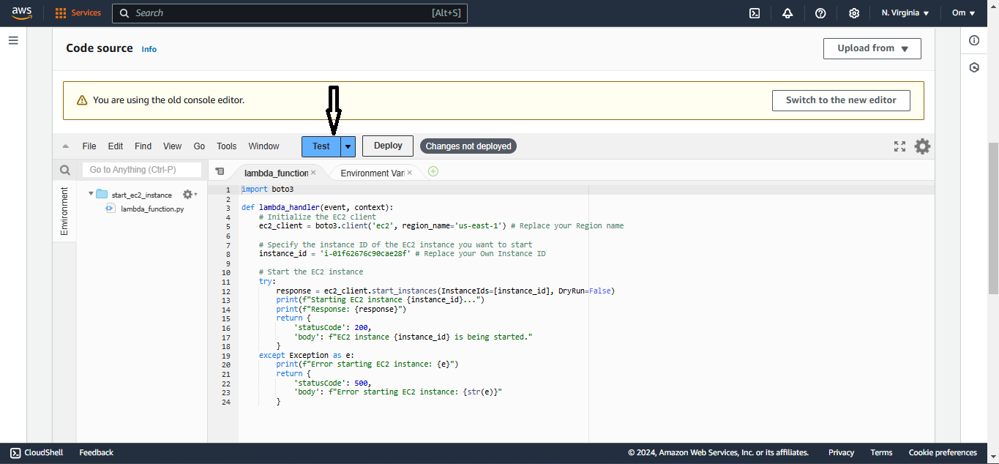

# Serverless EC2 Instance Scheduler for Company Working Hours 
## Scenario :
In some companies there is no need to run EC2 instances 24/7; You need instances for a specific time, such as company working hours, from 8:00 AM in the morning to 5:00 PM in the evening. To handle this scenario, I use two Lambda functions that are responsible for starting and stopping instances. This Lambda function will be triggered by CloudWatch Events both in the morning and in the evening. This solution is completely serverless.

## Setup Guide  :

### Step 1 :
### Creating the Instance :
1. Go to the EC2 Console.
2. Follow the steps below.

### Step 2 :
### Creating the Policy :

1. Go to the IAM Console.
2. Click on "Policies" and then Click on "Create policy"

3. Select services as EC2.
4. And Actions are DescribeInstances , StartInstances.

6. Now we have created a policy for starting instances. We also need to create a policy for stopping the instances. This is because we are going to create two Lambda functions: one for starting and one for stopping the instances. Each function will have its own role, and we will attach these two policies to their respective roles. 
7. Now  we are going to repeat the same steps for Creating Stopping Policy also. 
8. Everything is same , Except Actions because we are going to stop the instance. 
9. The Actions are DescribeInstances , StopInstances . 
10. Keep your Plolicy name as "stop-ec2-instance".

## Step 3 :
## Creating the Lambda functions :

1. Go to the lambda Console.
2. Follow the Outlined steps below.

Now again , go to the Lambda console and then test the code.

3. Now we Created  alambda function for Starting Instance.
4. We have to Reapeat the same steps again to Create a Lambda function for Stopping Instance , Keep your lambda function name as "Stop-EC2-demo".
5. The only changes we have to make are to replace the default code with the 'stop-ec2-instance.py' code and attach the policy we created for stopping instances to the role of this Lambda function.

 [2](screenshot/20.png)

6. As demonstrated above, when I test my Python code, it runs successfully and stops the instance.
7. Now, we are ready to proceed and create schedules for this functions.

### Step 5 :
### Creating the Schedules Using Cloud Watch :

1. Go to the Cloud Watch Console.
2. Follow the Outlined Steps below.

